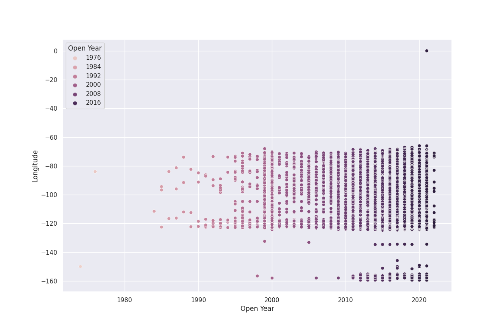
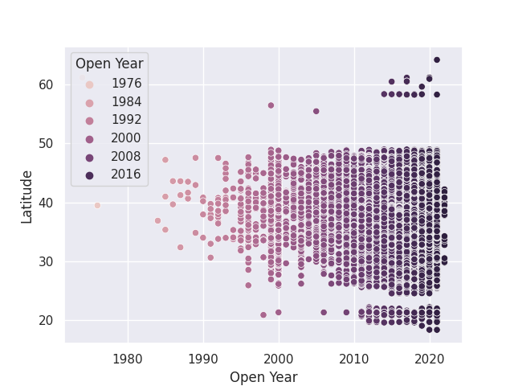

# Machine-Learning-Final-Project----Vitellaro-Salvatore
CS 4200

This dataset is information on alternative-fuel stations. I am interested in predicting the location and quantity of new stations in the future.
I think that the most relevant column types are dates, state, ZIP code, and latitude and longitude.

